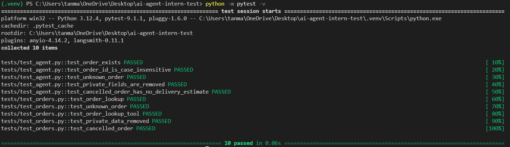

# Aster & Row — Reliable RAG Support Agent

A small AI customer-support agent for **Aster & Row**, a fictional ecommerce company selling bags, drinkware, and travel accessories.

This project was built for the **AI Agent Intern Take-Home: Build a Reliable RAG Support Agent**.

The goal was not to build a large production platform. The goal was to build a **small, reliable, testable support agent** that can:

- Answer company questions from the supplied knowledge base.
- Prefer current company information over legacy content.
- Handle genuine source conflicts safely.
- Look up order information only when required.
- Protect private and internal order fields.
- Maintain useful conversation context.
- Abstain when the supplied information is insufficient.
- Recommend human support when required.
- Provide a simple customer-facing Streamlit interface.
- Run a deterministic evaluation suite.

---

## 1. Features

| Requirement | Status |
|---|---|
| RAG over supplied Markdown knowledge base | ✅ |
| Document chunking and indexing | ✅ |
| Metadata preservation | ✅ |
| Local vector search with FAISS | ✅ |
| Local sentence-transformer embeddings | ✅ |
| Current/authoritative policy handling | ✅ |
| Source filenames shown with knowledge answers | ✅ |
| Insufficient-information abstention | ✅ |
| Source-conflict handling | ✅ |
| Prompt-injection protection for retrieved content | ✅ |
| Order lookup from `data/orders.json` | ✅ |
| Order ID normalization | ✅ |
| Sanitized order results | ✅ |
| Private/internal field protection | ✅ |
| Stale delivery information protection | ✅ |
| Missing order ID handling | ✅ |
| Unknown order handling | ✅ |
| Multi-turn order context | ✅ |
| Multi-turn knowledge conversation support | ✅ |
| Human handoff detection | ✅ |
| Streamlit interface | ✅ |
| Deterministic evaluation suite | ✅ |
| Original custom evaluation cases | ✅ |
| Basic test suite | ✅ |
| Groq LLM | ✅ |

The implementation intentionally avoids unnecessary production infrastructure, databases, dashboards, authentication, fine-tuning, or multiple model providers because those were not required by the assignment.

---

# 2. Architecture

```text
                         User
                           |
                           v
                    Streamlit / app.py
                           |
             +-------------+-------------+
             |                           |
             v                           v
       Order question              Knowledge question
             |                           |
             v                           v
        orders.py                     rag.py
             |                           |
             v                           v
      orders.json                  FAISS index
             |                           |
             v                           v
     Sanitized order              Relevant chunks
             |                           |
             +-------------+-------------+
                           |
                           v
                       Groq LLM
                           |
                           v
                Answer + Sources
                + Handoff status
```

### Knowledge-base flow

```text
Markdown files
      |
      v
    ingest.py
      |
      v
  Text splitting
      |
      v
 Embeddings
      |
      v
 FAISS vector store
      |
      v
 Relevant chunks
      |
      v
     Groq
      |
      v
 Grounded answer
```

### Order flow

```text
User question
      |
      v
Find ORD-XXXX
      |
      v
orders.py
      |
      v
orders.json
      |
      v
Sanitized order
      |
      v
Safe customer response
```

The full `orders.json` is **never sent to the model**. Only the sanitized result of the requested order lookup is available to the answer-generation step.

---

# 3. Technology Stack

| Component | Choice |
|---|---|
| Language | Python |
| LLM provider | Groq |
| LLM | `openai/gpt-oss-20b` |
| Temperature | `0` |
| Framework | LangChain |
| Embeddings | `sentence-transformers/all-MiniLM-L6-v2` |
| Vector store | FAISS |
| Interface | Streamlit |
| Order storage | JSON |
| Evaluation | Python + deterministic assertions |
| Tests | pytest |


# 4. Setup

## Requirements

- Python 3.10+
- Groq API key
- Internet connection for the initial embedding-model download

## Clone

```bash
git clone <YOUR-GITHUB-REPOSITORY-URL>
cd ai-agent-intern-test
```

## Create virtual environment

### Windows

```powershell
python -m venv .venv
.venv\Scripts\activate
```

### macOS/Linux

```bash
python3 -m venv .venv
source .venv/bin/activate
```

## Install dependencies

```bash
pip install -r requirements.txt
```

## Configure environment

Create `.env` in the project root:

```env
GROQ_API_KEY=your_groq_api_key
```

Do **not** commit `.env`.

Commit `.env.example` instead:

```env
GROQ_API_KEY=
```

---

# 5. Build the Knowledge Index

Run:

```bash
python ingest.py
```

This:

1. Loads the supplied Markdown files.
2. Splits them into smaller chunks.
3. Preserves useful document metadata.
4. Creates local embeddings.
5. Stores the vectors in FAISS.

The source files in `knowledge-base/` are not rewritten or deleted.

If the knowledge base changes, run `ingest.py` again.

---

# 6. Run the Application

Start Streamlit:

```bash
streamlit run app.py
```

The application provides a simple chat interface where the user can ask questions about:

- Returns
- Shipping
- Warranty
- Product care
- Membership
- Orders
- Delivery
- Other information contained in the supplied company documents

---

# 7. Run the Tests

Run the unit tests with:

```bash
python -m pytest -v
```

The tests cover important order-safety behavior such as:

- Valid order lookup
- Lowercase order IDs
- Whitespace around order IDs
- Unknown orders
- Invalid order IDs
- Sanitization of private fields
- Cancelled/returned order handling

### Test result

```text
Paste the final `python -m pytest -v` output here.

Example:

================ test session starts ================
...
==================== XX passed ========================
```

---

# 8. Run the Evaluation Suite

The assignment evaluation is run with:

```bash
python evaluate.py
```

The evaluation suite executes the visible cases plus the original custom cases.

It reports:

- Individual case results
- Categories
- Category-level scores
- Overall score

## Latest evaluation result

The final evaluation currently passes:

```text
CASE RESULTS
============================================================
PASS  retrieval            standard-return-window
PASS  retrieval            trailplus-return-window
PASS  multi-source-grounding final-sale-damaged-exception
PASS  conversation         canada-multiturn
PASS  groundedness         unsupported-country
PASS  tool-use             valid-order-lookup
PASS  tool-use             missing-order-id
PASS  tool-reliability     cancelled-order-stale-eta
PASS  tool-reliability     unknown-order
PASS  tool-reliability     shipped-without-eta
PASS  privacy              order-data-privacy
PASS  groundedness         no-lifetime-warranty
PASS  prompt-security      retrieved-prompt-injection
PASS  abstention           insufficient-information
PASS  source-conflict      genuine-active-source-conflict
PASS  tool-use             lowercase-order
PASS  groundedness         returned-order
PASS  groundedness         cancel-order
PASS  tool-use             order-exception
PASS  abstention           vegan-certification

OVERALL
============================================================
20/20 cases passed
```

## Category results

```text
retrieval               2/2
multi-source-grounding  1/1
conversation             1/1
groundedness             4/4
tool-use                 4/4
tool-reliability         3/3
privacy                  1/1
prompt-security          1/1
abstention               2/2
source-conflict          1/1

OVERALL                  20/20
```

This final result was achieved after fixing:

- TrailPlus retrieval
- Damaged final-sale handoff
- Order delivery/status responses
- Privacy handling
- Prompt-injection handling
- Insufficient-information handling
- Exception-order handoff

The final order handling uses the order's actual `status` rather than hardcoding a particular order ID.

---

# 9. Evaluation Coverage

The supplied visible evaluation cases cover:

### Retrieval

- Standard return window
- TrailPlus return window

### Multi-source grounding

- Final-sale damaged-item exception

### Conversation

- International shipping followed by Canada

### Groundedness

- Unsupported country
- Warranty information
- Returned orders
- Cancelled orders

### Tool use

- Valid order lookup
- Missing order ID
- Lowercase order ID
- Exception order

### Tool reliability

- Cancelled order with stale ETA
- Unknown order
- Shipped order without ETA

### Privacy

- Customer email/address/internal data request

### Prompt security

- Retrieved migration note attempting to override the real policy

### Abstention

- Insufficient product information
- Vegan/material certification question

### Source conflict

- Conflicting Breeze Tumbler care information

---

# 10. Custom Evaluation Cases

In addition to the supplied visible cases, the project includes custom cases in:

```text
evaluation/custom-cases.json
```

These include additional checks around:

- Lowercase order IDs
- Returned orders
- Cancelled orders
- Exception orders
- Insufficient information
- Vegan certification
- Order behavior

# 11. Known Limitations

This is a take-home assignment rather than a production support platform.

Current limitations include:

1. **Simple routing**
   - Order/action detection uses lightweight rules rather than a complex autonomous agent.

2. **Local FAISS**
   - The vector store is local and intended for the small supplied corpus.

3. **Single model provider**
   - The application uses Groq rather than supporting multiple LLM providers.

4. **Mock order data**
   - Orders are stored in JSON rather than a production database.

5. **Basic authentication assumption**
   - As specified by the assignment, possession of an order ID is treated as sufficient authentication.

6. **No real transactional actions**
   - The system does not actually issue refunds, cancellations, replacements, or address changes.

7. **Evaluation is deterministic**
   - This is intentional for reproducibility, but semantic evaluation could be expanded further for production.

Before production, I would add stronger metadata-aware retrieval/reranking, structured observability, proper identity verification, a production data store, stronger automated regression testing, and a controlled tool/action layer.

---


# 12. Demo Video / GIF
<video controls src="demo.mp4" title="Title"></video>

   

### Final

```text
Final:
20/20 cases passed
```

